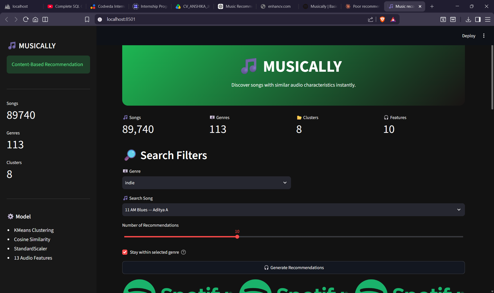

# 🎵 MUSICALLY — Content-Based Music Recommendation System

A Streamlit app that recommends songs based on **audio characteristics**
(danceability, energy, acousticness, valence, tempo, etc.) rather than
genre labels or listening history — powered by KMeans clustering and
cosine similarity over ~90,000 Spotify tracks.


---

## How It Works

1. **Clean** the raw Spotify dataset (drop nulls/duplicates, ~89,740
   tracks remain).
2. **Scale** 10 continuous audio features with `StandardScaler`.
3. **Cluster** songs into 8 groups with `KMeans`, chosen via silhouette
   score.
4. **Recommend**: given a song, find its cluster, compute cosine
   similarity against every other song in that cluster, and return the
   closest matches (optionally restricted to the same genre).

```
Raw dataset → clean → scale → KMeans cluster → cosine similarity → top-N
```

---

## Model Fix — Why `key`, `mode`, `time_signature` Were Dropped

The first version of this model fed **13** features into the scaler,
including `key` (a 12-value pitch class), `mode` (major/minor), and
`time_signature`. These are categorical, not continuous — but treated
as numbers, they carried as much variance as real perceptual features
like danceability or energy. The result: songs matched because they
shared a key or time signature, not because they sounded alike,
producing genre- and language-incoherent recommendations at inflated
similarity scores (95%+ across completely different genres).

Dropping those 3 features and re-clustering fixed it. Similarity scores
are now realistic and varied (see the app screenshots below — 62%,
74%, 85%, not a flat 95%+), and recommendations are audibly coherent.

Re-running the elbow/silhouette analysis on the corrected feature set
also changed the optimal cluster count from **10 → 8**:


---

## Exploratory Data Analysis

Distribution of the raw audio features before scaling:


Clusters projected into 2D with PCA — the 8 clusters separate into
clearly distinct regions of "sound space":


---

## App in Action



---

## Tech Stack

| Layer | Tool |
|---|---|
| UI | Streamlit |
| Clustering | scikit-learn (`KMeans`) |
| Similarity | scikit-learn (`cosine_similarity`) |
| Scaling | scikit-learn (`StandardScaler`) |
| Album art | Spotify Web API via `spotipy` |
| Data | [Spotify Tracks Dataset](https://www.kaggle.com/datasets/maharshipandya/-spotify-tracks-dataset) (Kaggle) |

---

## Project Structure

```
spotify_music_recommendation/
├── app.py                     # Streamlit UI — layout & user interaction only
├── music_recommendation.ipynb # Full pipeline: EDA → cleaning → clustering → model export
├── requirements.txt
│
├── data/
│   |── spotify_clustered_dataset.csv
│   └── dataset.csv
|
├── models/
│   ├── scaler.joblib
│   └── kmeans.joblib
│
|── spotify_api.py         
│
└── screenshots/                # Images used in this README
```

### A note on `spotify_api.py`

The original file had `CLIENT_ID` / `CLIENT_SECRET` hardcoded in plain
text — fine for local testing, but a real problem if this repo is
public. The version in `utils/` now reads credentials from Streamlit
secrets instead:

```toml
# .streamlit/secrets.toml  (add this file to .gitignore!)
SPOTIFY_CLIENT_ID = "your-client-id"
SPOTIFY_CLIENT_SECRET = "your-client-secret"
```

On Streamlit Community Cloud, set the same two keys under your app's
**Settings → Secrets** instead of committing a secrets file.

---

## Running Locally

```bash
pip install -r requirements.txt

# add your Spotify credentials
mkdir .streamlit
echo 'SPOTIFY_CLIENT_ID = "..."' >> .streamlit/secrets.toml
echo 'SPOTIFY_CLIENT_SECRET = "..."' >> .streamlit/secrets.toml

streamlit run app.py
```

---

## Future Improvements

- Hybrid scoring (blend genre/mood metadata into the similarity score
  instead of a hard genre restriction toggle)
- Popularity-aware re-ranking (surface well-known tracks first)
- User feedback loop (thumbs up/down to refine recommendations)

---

Built using Streamlit • KMeans • Spotify API
Developed by **Anshika Jain**
