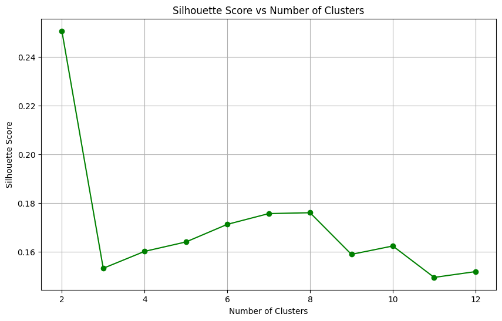
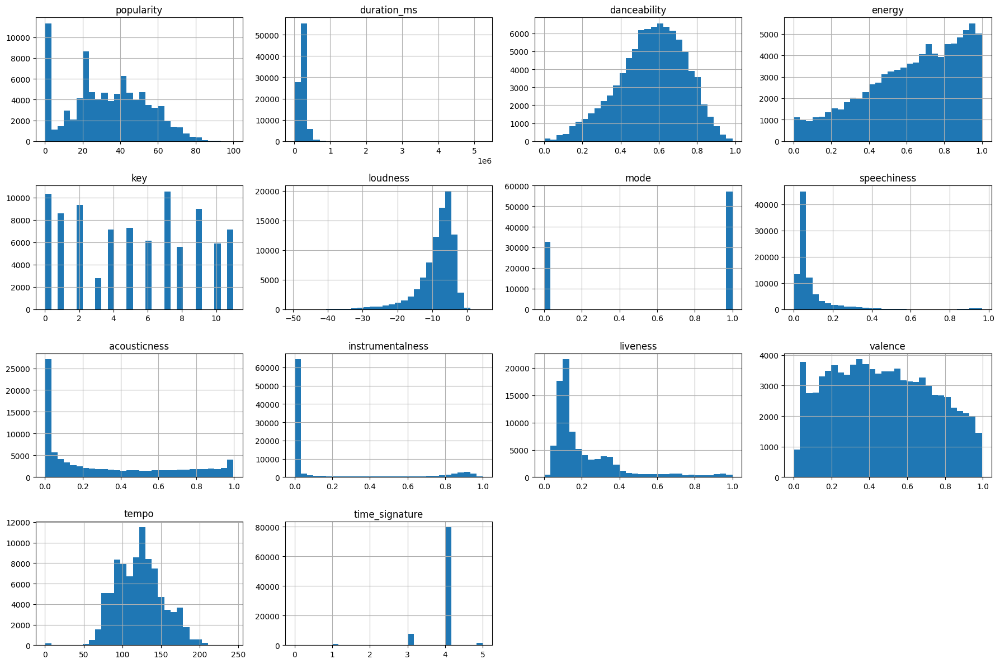
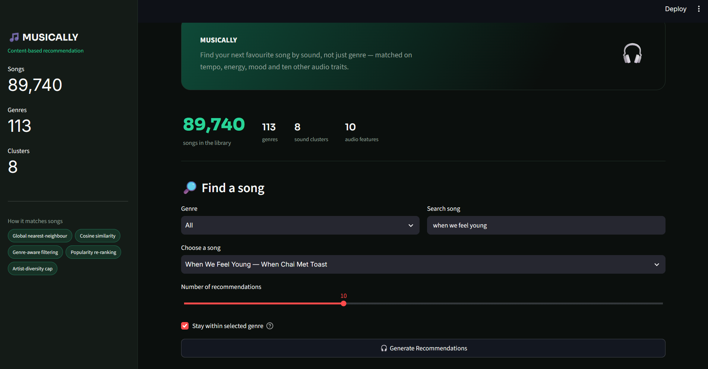
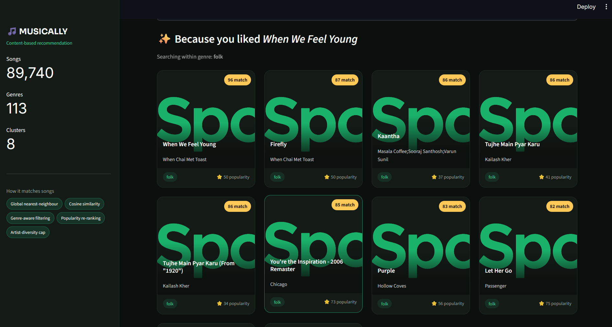

# 🎵 MUSICALLY — Content-Based Music Recommendation System

A Streamlit app that recommends songs based on **audio characteristics**
(danceability, energy, acousticness, valence, tempo, etc.) rather than
genre labels or listening history — matched with cosine similarity over
~90,000 Spotify tracks, with genre-aware filtering, a popularity
re-rank, and an artist-diversity cap layered on top.

---

## How It Works

1. **Clean** the raw Spotify dataset (drop nulls/duplicates, ~89,740
   tracks remain).
2. **Scale** 10 continuous audio features with `StandardScaler`.
3. **Cluster** songs into 8 groups with `KMeans` (used for EDA/visualization
   only — see below for why it's not used for retrieval anymore).
4. **Recommend**: given a song, compute cosine similarity against the
   candidate pool directly — the whole dataset, or just the song's own
   genre by default — then re-rank slightly by popularity and cap how
   many songs from one artist can appear in the results.

```
Raw dataset → clean → scale → cosine similarity (genre-aware, global) → re-rank → top-N
```

---

## Model Fix #1 — Why `key`, `mode`, `time_signature` Were Dropped

The first version of this model fed **13** features into the scaler,
including `key` (a 12-value pitch class), `mode` (major/minor), and
`time_signature`. These are categorical, not continuous — but treated
as numbers, they carried as much variance as real perceptual features
like danceability or energy. The result: songs matched because they
shared a key or time signature, not because they sounded alike,
producing genre- and language-incoherent recommendations at inflated
similarity scores (95%+ across completely different genres).

Dropping those 3 features and re-clustering fixed it. Re-running the
elbow/silhouette analysis on the corrected feature set also changed the
optimal cluster count from **10 → 8**:



---

## Model Fix #2 — Retiring the KMeans Hard-Cluster Gate

The original recommender found a song's KMeans cluster and only ever
searched *inside* that cluster. With just 8 clusters covering 114k
songs across 113 genres, a cluster turned out to be a rough audio
neighbourhood, not a genre — so a song like *Believer* pulled
recommendations from Bach, bluegrass, jazz, and tango, and an Indian
track pulled Russian, Chinese, and Brazilian songs alongside sensible
ones. Manually restricting a query to its own genre fixed this
immediately, which pointed at the real problem: the hard cluster
boundary, not a lack of "accuracy."

The retrieval logic was changed to:

```
Song → global nearest-neighbour search → genre-aware pool → popularity re-rank → artist-diversity cap
```

- **Audio similarity** is computed on demand against the candidate pool
  (no precomputed N×N matrix), so KMeans is no longer a gate — it's kept
  only for the EDA/PCA visualizations below.
- **Same-genre by default.** Searching a song pulls candidates from its
  own genre unless you turn that off, for cross-genre discovery.
- **Popularity is a small tie-breaker**, not a ranking driver — it's
  weighted low enough that it never turns this into a popularity
  recommender.
- **Artist diversity is capped** so one artist can't fill the whole
  results list.

---

## Exploratory Data Analysis

Distribution of the raw audio features before scaling:



Clusters projected into 2D with PCA — the 8 clusters separate into
clearly distinct regions of "sound space":


---

## App in Action




---


## Tech Stack

| Layer | Tool |
|---|---|
| UI | Streamlit |
| Clustering | scikit-learn (`KMeans`) |
| Similarity | scikit-learn (`cosine_similarity`) |
| Scaling | scikit-learn (`StandardScaler`) |
| Album art | Spotify Web API via `spotipy` |
| Data | [Spotify Tracks Dataset](https://www.kaggle.com/datasets/maharshipandya/-spotify-tracks-dataset) (Kaggle) |

---

## Project Structure

```
spotify_music_recommendation/
├── app.py                     # Streamlit UI — layout & user interaction only
├── music_recommendation.ipynb # Full pipeline: EDA → cleaning → clustering → model export
├── requirements.txt
│
├── data/
│   |── spotify_clustered_dataset.csv
│   └── dataset.csv
|
├── models/
│   ├── scaler.joblib
│   └── kmeans.joblib
│
|── spotify_api.py         
│
└── screenshots/                # Images used in this README
```

### A note on `spotify_api.py`

`spotify_api.py` never contains a Client ID or Secret in plain text — it
reads both from Streamlit secrets at runtime:

```toml
# .streamlit/secrets.toml  (kept out of git — see .gitignore)
SPOTIFY_CLIENT_ID = "your-client-id"
SPOTIFY_CLIENT_SECRET = "your-client-secret"
```

Get these from your app on the
[Spotify Developer Dashboard](https://developer.spotify.com/dashboard).
If a secret is ever exposed (committed by accident, pasted somewhere
public), treat it as compromised and regenerate it from the same
dashboard rather than reusing it.

On Streamlit Community Cloud, the same two keys are set under the app's
**Settings → Secrets** instead of a local file.

---

## Running Locally

```bash
pip install -r requirements.txt

mkdir .streamlit
echo 'SPOTIFY_CLIENT_ID = "..."' >> .streamlit/secrets.toml
echo 'SPOTIFY_CLIENT_SECRET = "..."' >> .streamlit/secrets.toml

streamlit run app.py
```

---

## Deploying

1. Push the repo to GitHub (`.streamlit/secrets.toml` should **not** be
   committed — confirm with `git status`).
2. On [share.streamlit.io](https://share.streamlit.io), create a new
   app pointing at this repo, branch `main`, main file `app.py`.
3. Under **Advanced settings → Secrets**, paste the same two Spotify
   keys.
4. Deploy — you'll get a shareable `https://your-app-name.streamlit.app`
   URL once the build finishes.

---

## Future Improvements

- User feedback loop (thumbs up/down to refine recommendations)
- Offline evaluation metrics (genre consistency, artist diversity,
  Precision@K) alongside human ratings, instead of showing raw
  similarity as "accuracy"
- Tune `popularity_weight` and `max_per_artist` against real user
  feedback rather than fixed defaults

---

Built using Streamlit • Cosine similarity • Spotify API
Developed by **Anshika Jain**

---


