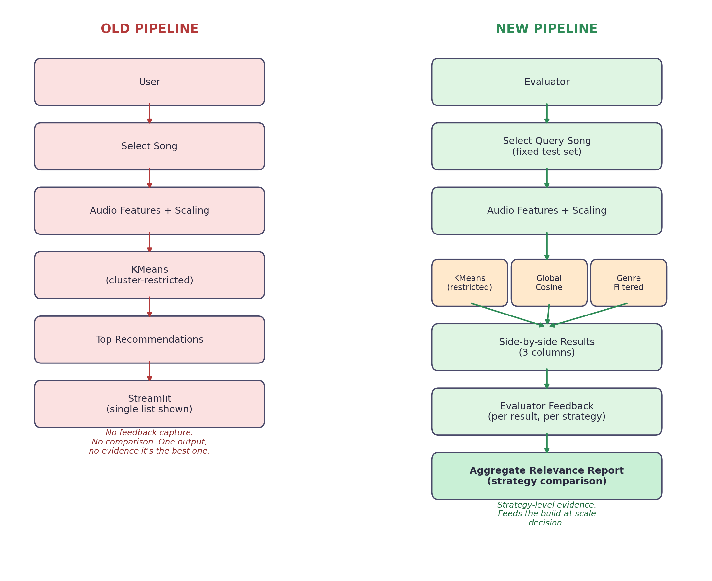

# MUSICALLY — Use Case Addition: Recommendation Strategy Evaluation

**Project:** MUSICALLY — Content-Based Music Recommendation System
**Document purpose:** Document the addition of a new use case — evaluating
multiple recommendation retrieval strategies against a controlled synthetic
dataset — to the existing system, including the trigger, the pipeline
change, the full PRD cycle, technical implementation, and the feedback
loop this creates going forward.

---

## 1. Trigger — Why This Change Is Needed Now

The existing MUSICALLY system is a working content-based recommender:
audio features from a ~80k song dataset are scaled, clustered with KMeans,
and a single ranked list is returned via cosine similarity for a chosen
seed song, served through a Streamlit app.

Two review points converged to trigger this addition:

1. **Positioning gap.** Framed as a consumer product, the natural question
   is "why use this instead of Spotify?" — and at 80k songs with no
   licensing or infrastructure behind it, there's no honest answer to that.
   The system's actual strength isn't consumer-scale discovery; it's that
   the retrieval logic is transparent and swappable, which is exactly what
   a team deciding *how* to build a recommender at scale needs to test
   before committing engineering time to one approach.

2. **No evidence behind the current strategy.** The system currently runs
   exactly one retrieval strategy (KMeans cluster-restricted) with no
   mechanism to check whether it's actually the best available option.
   Any decision to keep it, replace it, or combine it with another
   approach has so far been made without data.

Both issues are solved by the same change: repurpose MUSICALLY from a
single-output recommender into a **strategy evaluation tool** — a
controlled environment where multiple retrieval strategies can be run
against identical queries and compared, generating the evidence needed to
decide what to build against a real catalog.

---

## 2. Pipeline Comparison — Existing vs Proposed

| Aspect | Old pipeline | New pipeline |
|---|---|---|
| Output per query | One ranked list | One list per strategy (KMeans-restricted, global cosine, genre-filtered), shown side by side |
| Strategy | Fixed — KMeans cluster-restricted only | Pluggable — any strategy can be added as a module |
| Feedback | None captured | Per-result, per-strategy 👍/👎, logged with evaluator and timestamp |
| Evaluation | None — relevance was assumed | Aggregate relevance-rate per strategy, computed from logged feedback |
| Who it's for | An end listener | An evaluator (team member) judging strategies before a build decision |
| What it proves | That a recommendation can be generated | Which retrieval approach actually performs better, with evidence |

The core architectural change is straightforward: the single retrieval
function becomes three interchangeable strategy functions that all run
against the same query, and a feedback-capture layer is added on top of
what was previously a stateless display.

---

## 3. The Complete PRD Cycle

This use case was taken through the full requirements-to-decision cycle,
not built directly from an idea:

**Client / Team → Requirements**
The trigger above was raised with the team in a structured format
(requirement, current state, problem, alternative, trade-off,
recommendation) before any code was changed — see `06_feature_cycle_walkthrough.md`
for the full message. This avoided quietly changing the pipeline unilaterally.

**Requirements → PRD**
Formalized in `02_prd.md`: target user redefined as "a team building a
music platform," the use case rewritten around strategy evaluation rather
than consumer discovery, and functional requirements added specifically
for the comparison feature (run N strategies per query, side-by-side
display, per-result feedback, aggregate reporting, fixed test-query set).
Success criteria were deliberately written as *relative and qualitative*
("evaluators can tell which strategy performs more consistently") rather
than a fabricated accuracy percentage.

**PRD → Solutioning**
Documented in `03_solution.md`: the existing architecture was diagrammed,
the strategies under comparison were tabulated, and the cluster-restriction
issue was worked through as Problem → Options → Trade-offs → Decision,
landing on "KMeans for analysis only, global similarity for retrieval" as
the current default — one candidate among several, not a final answer.

**Solutioning → Implementation**
Concrete technical changes (Section 4 below) scoped directly from the PRD's
functional requirements.

**Implementation → Prototype → User Testing**
The comparison view will be implemented in Streamlit and tested against a fixed set of seed songs by evaluators. Their feedback will be logged in `04_user_feedback.md` — not simulated data.

**User Testing → Feedback → Analyze → New Version**
Aggregate results computed from logged feedback answer the PRD's success
criteria directly and become the input to `05_final_report.md`'s
recommendation for what to build at scale — closing the loop back to the
team (Section 6 below).

---

## 4. Technical Changes Required

1. **Refactor the single retrieval function into pluggable strategy
   modules.** Replace one `recommend(song)` function with a `strategies/`
   package — `kmeans_strategy.py`, `global_cosine_strategy.py`,
   `genre_filtered_strategy.py` — each accepting `(song, dataset)` and
   returning results in an identical schema, so any module can be added or
   removed without touching the app layer.

2. **Change the output contract from a flat list to a keyed structure.**
   `{"kmeans": [...], "global_cosine": [...], "genre_filtered": [...]}`
   instead of a single list — this is what makes side-by-side display and
   per-strategy feedback possible.

3. **Introduce a feedback schema.**
   A table (CSV or SQLite) with columns:
   `query_song, strategy, recommended_song, vote, evaluator, timestamp`.
   Every vote must be tagged with the strategy it belongs to — this is
   the single piece of data the entire evaluation depends on.

4. **Streamlit UI changes.**
   - `st.columns(n)` for side-by-side strategy display
   - 👍/👎 controls under every recommended song, writing to the feedback table
   - a separate tab computing and displaying relevance-rate per strategy
     (a pandas groupby on the feedback table)

5. **Fixed test-query set.** `data/test_queries.csv` — the same 5–10 seed
   songs reused across every evaluator, so comparisons are apples-to-apples
   rather than each evaluator testing arbitrary songs.

---

## 5. Implementation Plan

| Phase | Scope | Output |
|---|---|---|
| Phase 1 — Refactor | Split retrieval into strategy modules; standardize output schema | Three interchangeable strategy functions, unit-testable independently |
| Phase 2 — Comparison UI | Side-by-side columns, feedback controls, fixed test-query set | Working prototype in Streamlit |
| Phase 3 — Evaluator testing | Run the fixed test-query set past 2–3 evaluators, collect real votes | Populated feedback table, logged in `04_user_feedback.md` |
| Phase 4 — Analysis & recommendation | Aggregate relevance-rate per strategy; write up findings | Final recommendation in `05_final_report.md` |

Each phase produces a concrete artifact rather than moving straight to
"finished feature" — this is what makes the process reviewable at every
stage rather than only at the end.

---

## 6. Loop Back — How Feedback Re-enters the Cycle

The aggregate relevance report from Phase 4 doesn't end the process — it
feeds the next decision:

- If one strategy clearly outperforms the others → that becomes the
  recommendation for the real-catalog build, documented in
  `05_final_report.md`.
- If results are close or inconclusive → a new candidate strategy (e.g.
  hybrid ranking) is added, and the comparison cycle repeats with the
  updated set.
- Either outcome is logged, so the next person picking up this project can see not just what was built,
  but what was tried, what the evidence said, and why the current
  direction was chosen.

This is the mechanism that turns MUSICALLY from a one-shot demo into a
system with an actual, demonstrable collaboration and iteration process —
which was the original ask.

---

*Supporting documents: `01_problem_statement.md`, `02_prd.md`,
`03_solution.md`, `04_user_feedback.md`, `05_final_report.md`,
`06_feature_cycle_walkthrough.md`.*