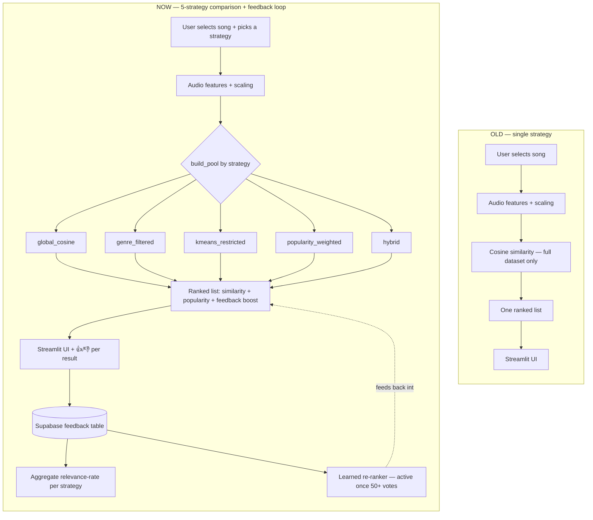

# MUSICALLY — Use Case: Recommendation Strategy Evaluation

**Project:** MUSICALLY — Content-Based Music Recommendation System
**Document purpose:** Full record of turning a single-strategy recommender
into a retrieval-strategy evaluation tool — the trigger, the PRD cycle,
what was actually built, the bugs found and fixed along the way, and the
feedback loop now driving what gets built next.

> This document reflects the **current, deployed state** of the project,
> not a plan. Every claim below is either live in the app or explicitly
> marked as not yet reached.

---

## 1. Trigger — Why This Change Was Needed

The original MUSICALLY was a working content-based recommender: audio
features from a public Kaggle dataset (~81k real Spotify tracks, not
synthetic data — see note below) scaled and compared with cosine
similarity, with KMeans used for exploratory clustering only, served
through a Streamlit app.

Two review points converged to trigger this change:

1. **Positioning gap.** Framed as a consumer product, the obvious question
   is "why use this instead of Spotify?" — and with ~81k tracks and no
   licensing or infrastructure behind it, there's no honest answer. The
   system's real strength is that its retrieval logic is transparent and
   swappable — exactly what a team deciding *how* to build a recommender
   at scale needs to test before committing engineering time.

2. **No evidence behind any one strategy.** Only one retrieval approach was
   implemented, with no mechanism to check whether it was actually the
   best option available.

Both are solved by the same change: repurpose MUSICALLY into a
**strategy evaluation tool** — multiple retrieval strategies run against
the same queries, compared using real evaluator feedback, generating
evidence instead of guesswork.

**Note on the dataset:** this is the public Kaggle "114k Spotify Tracks"
dataset — real audio-feature values (danceability, energy, valence, etc.)
for real, named tracks, pulled from Spotify's now-deprecated Audio
Features API before it shut down for new apps in Nov 2024. It is **not**
synthetic/fake data. It's a fixed subset (114 genres × 1,000 tracks,
~81k unique after de-duplication) rather than Spotify's full catalog —
that's the actual scale limitation, and it's a licensing/availability
limit, not a data-quality one. (Earlier drafts of these docs incorrectly
called this "synthetic" — corrected throughout.)

---

## 2. Pipeline: Before → Now

| Aspect | Old pipeline | Current pipeline |
|---|---|---|
| Strategies | One (global cosine, KMeans for analysis only) | Five: `global_cosine`, `genre_filtered`, `kmeans_restricted`, `popularity_weighted`, `hybrid` |
| Strategy selection | N/A | Sidebar dropdown; every vote tagged with the strategy active when it was cast |
| Feedback | None captured | Per-result 👍/👎, logged with `query_song, strategy, recommended_song, vote, evaluator, created_at` |
| Feedback storage | N/A | Supabase (hosted Postgres) — survives app restarts/redeploys |
| Evaluator identity | N/A | Auto-generated per-session ID (see §4 — this replaced a hardcoded-default bug) |
| Using the feedback | N/A | (a) aggregate relevance-rate table per strategy, (b) a learned re-ranker that nudges future rankings once there's enough labeled data |
| What it proves | That a recommendation can be generated | Which retrieval approach evaluators actually rate higher, with evidence — and, over time, which audio traits predict a "relevant" vote |

---

## 3. The Complete PRD Cycle

**Client / Team → Requirements** — the trigger above was raised before any
code changed (see `06_feature_cycle_walkthrough.md`).

**Requirements → PRD** (`02_prd.md`) — target user redefined as "a team
building a music platform," functional requirements written around
running multiple strategies, per-result feedback, and aggregate reporting.

**PRD → Solutioning** (`03_solution.md`) — architecture diagrammed, all 5
strategies tabulated with what candidate pool each searches, and real
implementation decisions (CSV → Supabase, the evaluator-ID bug, the
single-dispatcher-function vs separate-strategy-files choice) worked
through as Problem → Options → Trade-offs → Decision.

**Solutioning → Implementation** — all 5 strategies are live in the
deployed app; feedback logging is live and Supabase-backed; the learned
re-ranker module exists and is gated behind a real-data threshold.

**Implementation → Prototype → User Testing** — the app is deployed and
usable now. Real evaluator votes are accumulating (a handful so far, all
`global_cosine` — see `04_user_feedback.md` for the current count).
Testing is ongoing, not finished.

**User Testing → Feedback → Analyze → New Version** — once enough votes
exist across all 5 strategies, `relevance_rate()` produces the real
per-strategy comparison, and crossing 50 labeled votes with both 👍 and
👎 present activates the learned re-ranker automatically. Both feed
`05_final_report.md`.

---

## 4. What Actually Got Built (and what broke, and got fixed)

This section exists because the honest version of "what I did" includes
the mistakes caught along the way, not just the final code.

1. **5 retrieval strategies**, dispatched from one `build_pool(selected_row, strategy)`
   function in `app.py` rather than 5 separate strategy files as originally
   planned in an earlier draft of this doc — with only 5 strategies and
   shared ranking logic, one function with clear branches was simpler to
   maintain than a `strategies/` package, without losing pluggability
   (adding a 6th strategy is still a few lines, not a rewrite).

2. **Feedback storage: local CSV → Supabase.** The first working version
   logged votes to a CSV file. That was flagged honestly to the mentor
   before it became a problem: Streamlit Community Cloud's filesystem is
   ephemeral, so a CSV would silently lose every vote on redeploy/restart.
   Migrated to Supabase (hosted Postgres) instead — same public API in
   `utils/feedback.py`, so `app.py` didn't need to change for the swap.

3. **Bug found after deploying the Supabase migration:** every vote was
   being logged with the same evaluator value, `evaluator_01`. Root cause
   was a sidebar text input with that string hardcoded as its default,
   which nobody was ever changing. Fixed by generating a random per-session
   ID (`uuid`) automatically when the app first loads, so each browser
   session gets a distinct evaluator tag with no manual step.

4. **Learned re-ranker (`utils/reranker.py`).** The original feedback
   boost used a hand-guessed weight (`feedback_weight=0.05`) applied to a
   song's raw historical relevance rate. This was replaced with a proper
   model path: once there are 50+ labeled votes with both 👍 and 👎
   present, a logistic regression trains on `(audio features →
   relevant/not_relevant)` from real Supabase feedback, and its predicted
   probability becomes the boost — learned weights instead of a guess.
   Below that threshold (true as of this writing), the original heuristic
   is used as a safe fallback, and the UI shows which mode is active.

---

## 5. Loop Back — How Feedback Re-enters the Cycle

- Once enough votes exist across all 5 strategies → the aggregate
  relevance-rate table becomes the actual recommendation for what to
  build at real scale, written into `05_final_report.md`.
- Once 50+ labeled votes exist → the learned re-ranker activates
  automatically, and its learned feature weights become a finding in
  their own right (which audio traits evaluators actually respond to).
- If results are close/inconclusive → a new candidate strategy is added
  and the comparison repeats.
- Every decision — including the ones that turned out to be wrong first
  (CSV storage, the evaluator-ID bug) — is logged, not hidden, so the
  next person picking this up sees the real path, not just the endpoint.

---

*Supporting documents: `01_problem_statement.md`, `02_prd.md`,
`03_solution.md`, `04_user_feedback.md`, `05_final_report.md`,
`06_feature_cycle_walkthrough.md`.*
