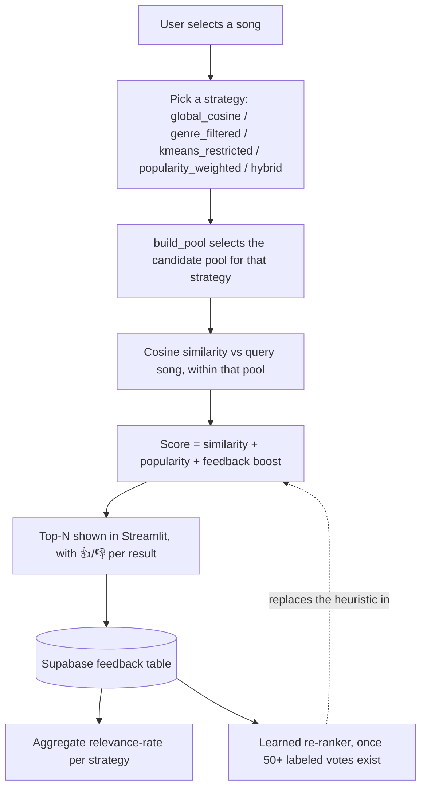

# 03 — Solution

This is the "how I thought about it before/while building it" document.
Every decision below is a real one made during this project, including the
ones that had to be reversed after being caught in testing.

## Architecture (current, deployed)

KMeans is fit once during preprocessing and stored as a `cluster` column
in the dataset — it's used both for the `kmeans_restricted`/`hybrid`
strategies' pool selection and for exploratory analysis, not as a
separate always-on gate the way the very first version used it.

## Strategies under comparison

| Strategy | Candidate pool | Status |
|---|---|---|
| `global_cosine` | Full dataset | Implemented |
| `genre_filtered` | Songs sharing the query song's `track_genre` | Implemented |
| `kmeans_restricted` | Songs sharing the query song's KMeans `cluster` | Implemented |
| `popularity_weighted` | Full dataset, but `popularity_weight` raised to 0.45 (from the default 0.10) so ranking — not just pool — differs meaningfully | Implemented |
| `hybrid` | Songs matching **both** genre and cluster | Implemented |

Ranking math (similarity + popularity + feedback boost) is identical
across all 5 strategies — only the candidate pool (and, for
`popularity_weighted`, one ranking weight) differs. This is deliberate:
it keeps the comparison about pool selection, not about five different
scoring formulas.

A pool smaller than 5 songs (can happen for `kmeans_restricted`/`hybrid`
on a rare cluster+genre combination) falls back to the full dataset
rather than returning a near-empty result.

## Decision log
_(Real issues hit during this project, in the order they came up.)_

### Issue: One strategy, no way to compare
**Problem:** Only global cosine similarity was implemented; no evidence
existed for whether it was actually the best available approach.
**Options:**
- A — Keep one strategy, trust intuition
- B — Add strategies as separate files in a `strategies/` package (each
  taking `(song, dataset)`, same output shape) — the original plan
- C — Add strategies as branches in one `build_pool(selected_row, strategy)`
  dispatcher function inside `app.py`
**Decision:** C.
**Reason:** With exactly 5 strategies sharing all of their ranking logic
and most of their pool-selection logic, a `strategies/` package would have
meant 5 files that mostly duplicate the same cosine-similarity + scoring
code, with only the pool-filter line differing. One function with 5 clear
branches was simpler to read, test, and extend (a 6th strategy is a new
`elif`, not a new file) without losing the "pluggable" property the
original plan was trying to achieve. **This changed from what
`02_prd.md`/`06_feature_cycle_walkthrough.md` originally proposed** — noted
here rather than silently diverging from the written plan.

### Issue: Feedback storage was local CSV
**Problem:** The first working version of feedback logging wrote to a CSV
file. Streamlit Community Cloud's filesystem is ephemeral — any restart
or redeploy would silently wipe every recorded vote.
**Options:**
- A — Keep the CSV, accept data loss on redeploy
- B — Migrate to Supabase (hosted Postgres)
- C — Migrate to SQLite (still local to the container — same ephemeral
  filesystem problem, doesn't actually solve it)
**Decision:** B.
**Reason:** Only Supabase actually survives redeploys. `utils/feedback.py`
was rewritten to use the `supabase-py` client but keeps the same public
functions (`log_feedback`, `load_feedback`, `relevance_rate`), so `app.py`
needed no changes to its calling code — only its imports and setup.
**Caught how:** flagged proactively before it caused data loss, once the
ephemeral-filesystem behavior was understood — not discovered by losing
data first.

### Issue: Every evaluator's vote was logged identically
**Problem:** After the Supabase migration, every row in the feedback
table had the exact same `evaluator` value (`evaluator_01`), making it
impossible to tell one evaluator's votes from another's.
**Root cause:** a sidebar `st.text_input` for "Evaluator ID" had
`evaluator_01` hardcoded as its default value, and nothing was prompting
users to change it.
**Options:**
- A — Ask each evaluator to type a name once (manual, but ties votes to a
  real identity)
- B — Auto-generate a random ID per browser session (`uuid`), no manual
  step
**Decision:** B, for now.
**Reason:** Removes the failure mode entirely (nothing to forget to type)
at the cost of not knowing *which real person* a session belongs to — a
session-level ID, not a person-level one. Acceptable at current evaluator
counts; flagged as a real limitation, not hidden (see `04_user_feedback.md` §9).
**Caught how:** live-tested the deployed app, checked the Supabase table
directly, saw every row identical — this is the project's clearest
"caught my own mistake by testing, not by assuming" example.

### Issue: The feedback boost weight was a guess
**Problem:** `apply_feedback_boost()` nudged rankings using a song's
historical relevance rate, weighted by a hand-picked constant
(`feedback_weight=0.05`) with no justification.
**Options:**
- A — Keep the guessed constant indefinitely
- B — Replace it with a model trained on real feedback (logistic
  regression: audio features → relevant/not_relevant), gated behind a
  minimum labeled-data threshold
**Decision:** B, implemented in `utils/reranker.py`, gated at 50+ labeled
votes with both 👍 and 👎 present. Below the threshold, the original
heuristic remains the active fallback — a model trained on a handful of
votes would fit noise, not signal. See `05_final_report.md` for the
current status and what happens once the threshold is crossed.
