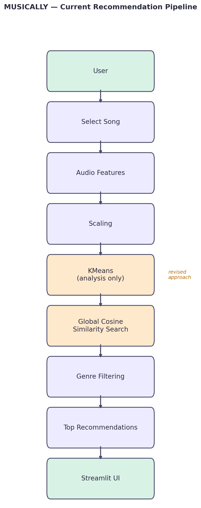

# 03 — Solution

This is the "how I thought about it before building it" document. Note the framing here: the pipeline below isn't presented as *the* answer — it's one strategy among several being compared. The evaluation tool's job is to make that comparison visible.

## Existing architecture (baseline strategy)

User → Select Song → Audio Features → Scaling → KMeans → Cosine Similarity → Top Recommendations → Streamlit

## Strategies under comparison
_(This is the core of the eval tool — list every retrieval strategy being tested against the same queries.)_

| Strategy | Description | Status |
|---|---|---|
| Cluster-restricted KMeans | Retrieval limited to the seed song's KMeans cluster | Baseline / being phased out |
| Global cosine similarity | KMeans used for analysis only; retrieval searches full dataset | Current default |
| Genre-filtered global search | Global similarity + genre constraint | In progress |
| Hybrid ranking | Blend of cluster proximity + global similarity score | _(not yet built)_ |

## Identified issues
_(Only write issues you actually observed — from your own testing, team discussion, client feedback, or user testing. Don't invent them.)_

### Issue: Recommendation relevance
Current retrieval is restricted to the song's KMeans cluster, which can exclude relevant songs that happen to fall in a different cluster.

**Option A** — Keep current KMeans filtering
**Option B** — Remove hard cluster restriction
**Option C** — Use KMeans only for analysis, perform global similarity search
**Option D** — Hybrid ranking (blend cluster proximity + global similarity)

**Decision:** Option C
**Reason:** Avoids excluding potentially relevant songs solely because they belong to a different cluster, while still keeping KMeans useful for exploratory analysis (e.g. visualizing genre clusters). This becomes one of the strategies compared in the eval tool, not a final choice.

### Issue: _(add your next real issue here)_
**Problem:**
**Options:**
**Trade-offs:**
**Decision:**

## Tech-stack suggestion (if/when relevant)
**Requirement:** _(what are we trying to achieve?)_
**Current technology:** _(what are we using?)_
**Problem:** _(what limitation exists?)_
**Alternative:** _(what could we use?)_
**Trade-off:** _(what do we gain/lose?)_
**Recommendation:** _(what would you choose, and why?)_
