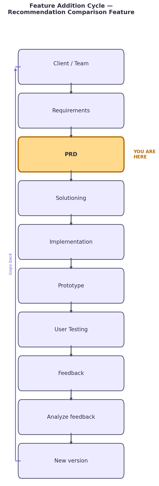

# 06 — Feature Addition Cycle: Recommendation Comparison

This doc showcases the full cycle for adding one specific feature to the
existing MUSICALLY system — running multiple retrieval strategies on the
same query and comparing them — so Prateek can see the process, not just
the final code.

---

## 1. Trigger — what started this

Current system only runs one retrieval strategy (cluster-restricted KMeans)
in the live Streamlit app. There's no way to check whether a different
strategy (global cosine similarity, genre-filtered) would surface more
relevant songs — decisions about which strategy to keep are being made on
intuition, not evidence.

## 2. Communicating it to the team (before building anything)

Message sent to Prateek/team, in the tech-suggestion format:

> **Requirement:** We need evidence on which retrieval strategy — cluster-restricted KMeans, global cosine similarity, or genre-filtered — actually returns more relevant songs, before committing to one.
>
> **Current:** Only cluster-restricted KMeans is live in the app. No side-by-side comparison exists.
>
> **Problem:** We can't validate which approach is better without eyeballing outputs, and right now there's no way to record that judgment anywhere.
>
> **Alternative:** Add a comparison mode — run 2–3 strategies per query, show results side by side, let an evaluator vote on relevance per result.
>
> **Trade-off:** More UI complexity and more compute per query (running multiple strategies at once), but it avoids locking in the wrong strategy before real users see it.
>
> **Recommendation:** Build the comparison view now, scoped to Streamlit, with feedback logged to a simple CSV/SQLite table. Cheap to build, enough to get a directional answer before any production commitment.

This is the artifact that proves "I raised it and asked" rather than
silently deciding and shipping.

## 3. PRD update for this feature

Added to `02_prd.md`'s functional requirements, scoped specifically to this feature:

| # | Requirement | Why |
|---|---|---|
| 1 | Given one seed song, system runs it through 2–3 retrieval strategies | Core of the comparison |
| 2 | Each strategy's top-N results shown in its own column, same query | Lets an evaluator compare fairly |
| 3 | Each result has a 👍/👎 control | Captures relevance judgment per strategy, per song |
| 4 | Feedback stored with query, strategy, song, vote, evaluator, timestamp | Needed to aggregate later — a vote with no strategy tag is useless |
| 5 | Aggregate view showing relevance-rate per strategy | This is the actual deliverable — the number that drives the decision |
| 6 | Fixed set of 5–10 test queries reused across evaluators | Without this, comparisons aren't apples-to-apples |

**Success criteria for this feature specifically:** an evaluator can look at
the aggregate view and say which strategy has a consistently higher
relevance rate across the fixed test queries — not "it felt better."

## 4. Technical / pipeline changes required

This is the concrete list to actually push to the repo:

1. **Refactor the single `recommend()` function into pluggable strategies.**
   Currently one function does KMeans-restricted retrieval. Split into a
   `strategies/` module: `kmeans_strategy.py`, `global_cosine_strategy.py`,
   `genre_filtered_strategy.py` — each takes `(song, dataset)` and returns
   the same output shape.

2. **Change the output shape from a flat list to a keyed dict.**
   Old: `[song1, song2, song3, ...]`
   New: `{"kmeans": [...], "global_cosine": [...], "genre_filtered": [...]}`

3. **New feedback schema** (CSV or SQLite table):
   `query_song, strategy, recommended_song, vote, evaluator, timestamp`
   — every vote must carry which strategy it belongs to.

4. **Streamlit UI changes:**
   - `st.columns(n_strategies)` to lay out results side by side
   - 👍/👎 buttons under each recommendation, writing to the feedback table
   - a separate tab/section for the aggregate relevance-rate view (simple
     pandas groupby on the feedback table)

5. **Fixed test-query file:** `data/test_queries.csv` — same 5–10 seed
   songs used across every evaluator so results are comparable.

## 5. Implementation → prototype → testing

- Build steps 1–4 above → working prototype in Streamlit
- Run a first round of user testing with 2–3 evaluators using the fixed
  test-query set → log results in `04_user_feedback.md`
- After ~1 week of evaluator votes, pull the aggregate view → this becomes
  the input to `05_final_report.md`'s "recommendation for building at scale"

## 6. Where this loops back

Aggregate results feed a decision: keep one strategy, keep a hybrid, or
add another candidate strategy and repeat the cycle. Whatever changes,
it gets logged — this is what keeps the whole thing from being a one-time
demo instead of an actual iterative process.
