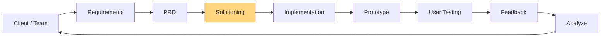

# 06 — Feature Addition Cycle: From One Strategy to a Learned Feedback Loop

This doc walks through the full, real cycle for this project — not just
the final code, but the order things actually happened in, including the
points where testing caught something wrong and it had to be fixed.

*(`PRD` and `Solutioning` were revisited more than once as real issues
came up mid-implementation — the loop above isn't strictly one-pass, and
§3–§5 below show where that happened.)*

---

## 1. Trigger — what started this

The live app ran exactly one retrieval strategy (global cosine
similarity, with KMeans used only for exploratory clustering). There was
no way to check whether a different approach — genre-restricted,
cluster-restricted, popularity-weighted, or some hybrid — would actually
surface more relevant songs. Decisions about what to build next were
being made on intuition, not evidence.

## 2. Communicating it to the team before building anything

> **Requirement:** We need evidence on which retrieval strategy actually
> returns more relevant songs, before committing to one.
>
> **Current:** Only global cosine similarity is live. No comparison, no
> feedback capture exists.
>
> **Problem:** We can't validate which approach is better without a
> structured way to record evaluator judgment.
>
> **Alternative:** Add a strategy picker with several retrieval modes, let
> an evaluator vote relevant/not-relevant per result, and store that
> feedback somewhere durable.
>
> **Trade-off:** More UI and more branching logic per query, but it avoids
> locking in a strategy before there's any evidence behind it.
>
> **Recommendation:** Build it directly in the live Streamlit app, with
> feedback logged to a real, persistent store (not a fragile local file) —
> cheap enough to build now, real enough to trust the results.

## 3. What was planned vs. what was actually built

The original PRD/solutioning drafts proposed a `strategies/` package —
one file per strategy, each a standalone function. During implementation
this was simplified to a single `build_pool(selected_row, strategy)`
dispatcher inside `app.py`, once it was clear all 5 strategies share
identical ranking logic and differ only in which candidate pool they
search. This is flagged explicitly in `03_solution.md`'s decision log —
the plan changed once the implementation made the original plan look like
unnecessary duplication, and that's recorded rather than quietly ignored.

## 4. Building it — in the order it actually happened

1. **Refactored the single `recommend()` into `build_pool()` + `recommend(strategy=...)`**,
   with 5 strategies: `global_cosine`, `genre_filtered`, `kmeans_restricted`,
   `popularity_weighted`, `hybrid`.
2. **Added the strategy picker** to the sidebar, and tagged every vote
   with whichever strategy was active at search time.
3. **Added feedback logging** — 👍/👎 per result, first version wrote to a
   local CSV.
4. **Caught a storage bug before it caused data loss:** Streamlit
   Community Cloud's filesystem is ephemeral — a CSV would be silently
   wiped on every restart/redeploy. Migrated feedback storage to Supabase
   (hosted Postgres) instead, keeping `utils/feedback.py`'s public
   functions unchanged so `app.py` didn't need to change its calling
   code.
5. **Caught a real bug after deploying the migration:** checked the live
   Supabase table directly and found every single row logged with the
   identical evaluator value, `evaluator_01`. Traced it to a hardcoded
   default on a sidebar text input that nothing was prompting people to
   change. Fixed by auto-generating a random per-session ID instead —
   removes the failure mode rather than just documenting around it.
6. **Asked the harder question: what's the point of collecting feedback
   at all, beyond a display table?** This led to building
   `utils/reranker.py` — a logistic regression trained on real feedback
   that replaces the original hand-guessed `feedback_weight=0.05`, gated
   behind a 50-labeled-vote threshold so it can't activate on too little
   data and overfit to noise. Below the threshold, the original heuristic
   stays active as a safe fallback, and the app shows which mode is
   running.

## 5. Where I changed my mind, and where a suggestion turned out wrong

> This section is intentionally left for direct, first-person reflection
> rather than written up generically — it's meant to capture a real
> moment where an AI-assisted suggestion led somewhere that had to be
> caught and corrected, in my own words, not a templated example.
>
> Candidates worth thinking about honestly: the `strategies/` package →
> single-dispatcher change in §3, the CSV → Supabase migration, or the
> evaluator-ID bug itself — was any of these a case where I initially
> accepted a suggestion without fully checking it, and only caught the
> problem by actually testing the deployed app? What did that teach me
> about verifying AI-assisted work rather than trusting it by default?

## 6. Where this loops back

Once real feedback exists spread across all 5 strategies:
- the aggregate relevance table (`04_user_feedback.md` §8,
  `05_final_report.md` §9) becomes real evidence for what to build at
  scale, and
- crossing 50 labeled votes activates the learned re-ranker
  automatically, turning the feedback loop from "we display what
  happened" into "the system gets better because of what happened."

Either way, the result gets logged in `05_final_report.md`, and the next
iteration (tune a strategy, add a new one, or move toward a real catalog)
starts from that evidence — not from scratch.
